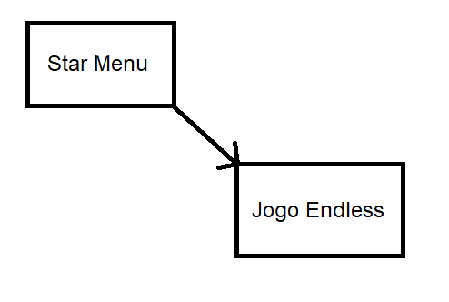

# Bate-Max
Um jogo de carrinho bate-bate no estilo gladiator

# Identidade do jogo (Conceito)

Você é um carrinho-gladiador em uma cratera na lua lutando pela sobrevivência. Você deve empurrar seus oponenter para fora da arena

# Descrição da mecânica (Core Mechanics / System design)

Jogo em primeira ou terceira pessoa. Conta com um sistema de nitro para ajudar no impulso. Movimente e use o nitro para bater nos outros jogadores e expulsá-los da arena

# Características (Mundo do jogo)

O mapa consiste em uma cratera em forma de ring/arena

# Arte

todos os modelos 3D são autorais.

O skybox foi tirado de https://www.cgtrader.com/items/257269/download-page

# Música/Trilha Sonora

todos os sons foram tirados de https://freesound.org/

# Interface

A interface inicial é um lobby para se criar ou entrar em uma sala.

Durante o jogo, é possivel abrir uma tela de opções que se pode mudar o volume da musica de fundo ou sair do jogo.

# Controles

W, A, S, D - Mover o carrinho

Space bar - Nitro

ESC - Menu de opções

# Dificuldade

A dificuldade do jogo é ditada pela habilidade dos outros jogadores.

# Fluxo do jogo

# Personagens

cada player é m carrinho bate-bate

# Definições gerais

### Gênero;

endless, multiplayer

### Plataformas;

Windows, Linux e MAC

### Público alvo;

Todos